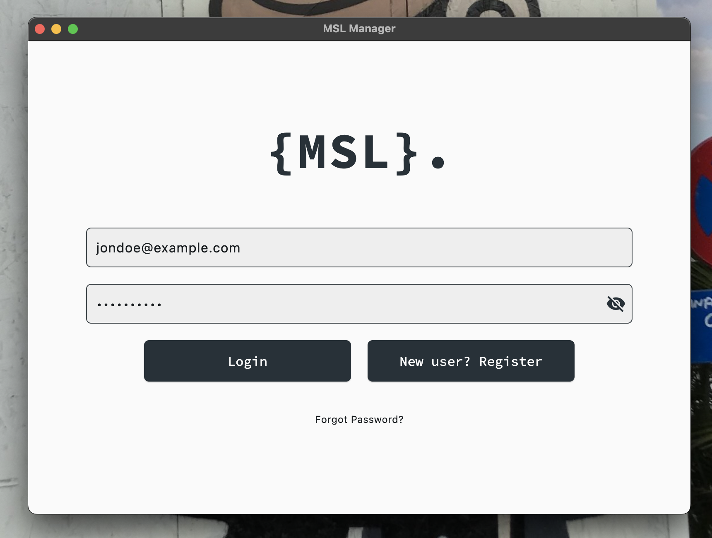
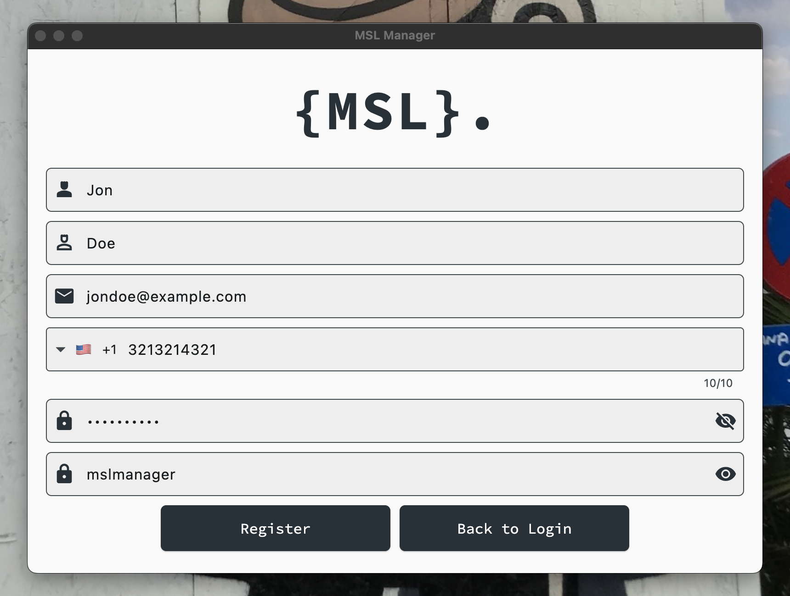
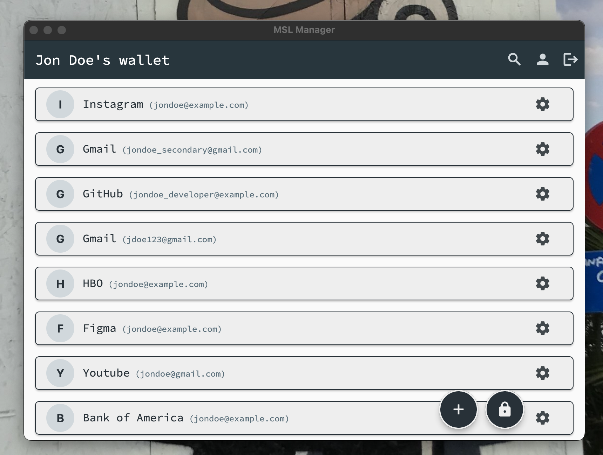
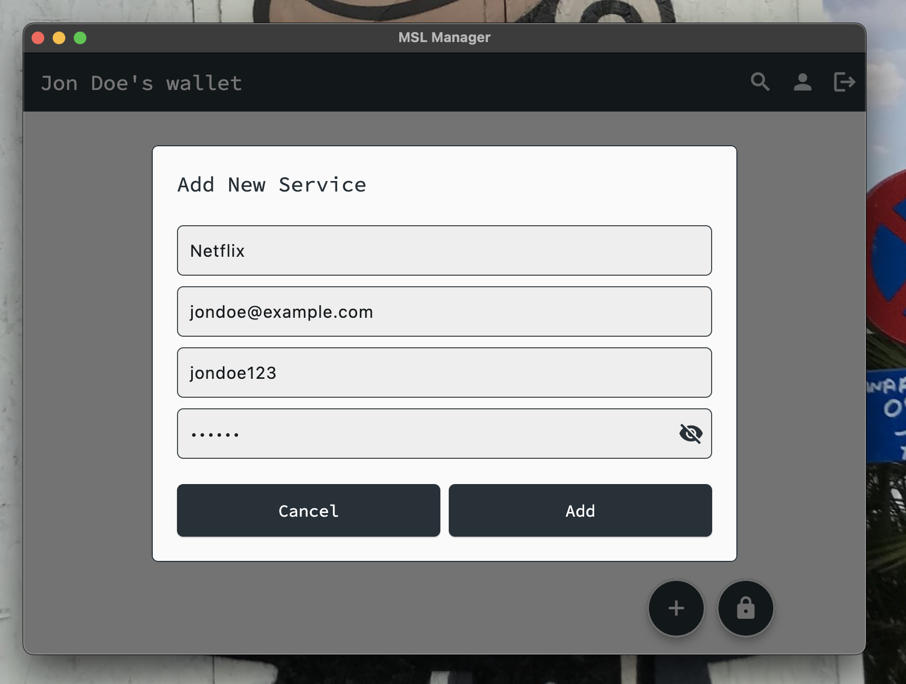
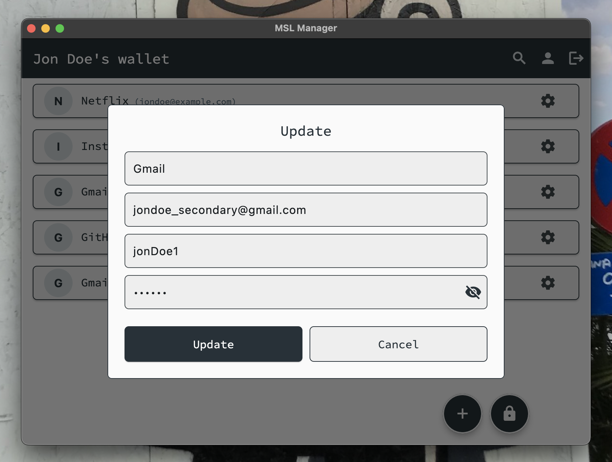
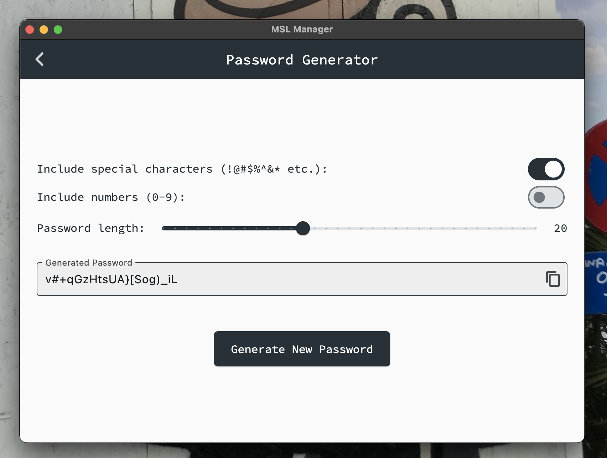
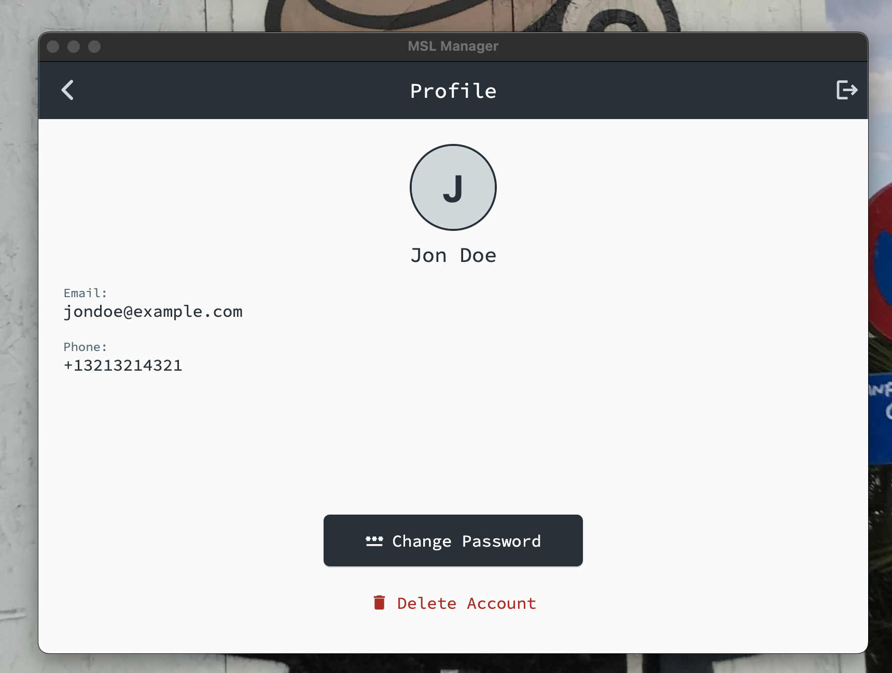

# MSL Manager

MSL is a password wallet app developed as a personal project for macOS using Dart/Flutter and Firebase. This application is designed to provide users with a secure, convenient, and easy-to-use solution for storing and managing passwords and sensitive credentials.

Feel free to fork this project, modify it, and adapt it to your own needs!

## Features

- **Cross-platform UI:** Built with Flutter for a smooth and native-like experience on macOS.
- **Secure Storage:** Utilizes Firebase for encrypted cloud storage of passwords.
- **Password Generator:** Generate strong, random passwords directly within the app.
- **Search and Organize:** Easily search, filter, and organize your credentials.
- **Clipboard Management:** Quick copy to clipboard with automatic clearing for added safety.
- **Backup and Restore:** Cloud sync to ensure your passwords are never lost.

## In Progress

- **Biometric Authentication:** (Planned) Support for Face ID/Touch ID on macOS devices.

## Screenshots

<p align="center">
  
  <br><b>Login Page</b>
</p>

<p align="center">
  
  <br><b>Register Page</b>
</p>

<p align="center">
  
  <br><b>Home Page</b>
</p>

<p align="center">
  
  <br><b>Add Service Dialog</b>
</p>

<p align="center">
  
  <br><b>Update Dialog</b>
</p>

<p align="center">
  
  <br><b>Password Generator Page</b>
</p>

<p align="center">
  
  <br><b>Profile Page</b>
</p>

## Security & Encryption

All sensitive user data, such as passwords and credentials, are encrypted on the client side before being stored in the cloud. This ensures that even if the database is compromised, the data remains protected.

With this approach, the private key and decrypted passwords can only be accessed if the client’s device itself is compromised (e.g., by malware).

### How Encryption Works

- **AES-256 Encryption:**  
  The app uses the [AES (Advanced Encryption Standard)](https://en.wikipedia.org/wiki/Advanced_Encryption_Standard) algorithm with a 256-bit key for encrypting all sensitive fields. AES is a widely adopted symmetric encryption standard known for its security and performance.

- **Key Derivation:**  
  The encryption key is derived from the user's unique ID (`userId`) using the SHA-256 hash function. This produces a 32-byte (256-bit) key, ensuring that each user has a unique encryption key.

- **Random IV (Initialization Vector):**  
  For every encryption operation, a new random 16-byte IV is generated. This ensures that encrypting the same value multiple times will produce different ciphertexts, enhancing security.

- **Storage Format:**  
  The encrypted data is stored as a string in the format:  
  ```
  <IV in base64>:<Encrypted value in base64>
  ```
  This allows the app to retrieve both the IV and the ciphertext for decryption.

- **Decryption:**  
  To decrypt, the app splits the stored string to extract the IV and ciphertext, then uses the same key derivation process to reconstruct the AES key and decrypt the data.

### Example

When a password is saved:
1. The app derives a key from the user's ID using SHA-256.
2. It generates a random IV.
3. It encrypts the password using AES-256 with the derived key and IV.
4. It stores the IV and encrypted password together.

When a password is retrieved:
1. The app derives the same key from the user's ID.
2. It extracts the IV and ciphertext from storage.
3. It decrypts the ciphertext using AES-256 with the derived key and IV.

> **Note:**  
> The encryption and decryption are handled entirely on the client side. The server (Firebase) never sees unencrypted sensitive data or the user's encryption key.

## Getting Started

### Prerequisites

- [Flutter SDK](https://flutter.dev/docs/get-started/install)
- [Dart](https://dart.dev/get-dart)
- macOS device
- Firebase account (for backend setup)

### Installation

1. **Clone the repository:**
   ```sh
   git clone https://github.com/mslazzuri/MSL-Manager.git
   cd MSL-Manager
   ```

2. **Install dependencies:**
   ```sh
   flutter pub get
   ```

3. **Set up Firebase:**
   - Create a new Firebase project at [Firebase Console](https://console.firebase.google.com/).
   - Follow the instructions to add a macOS app and download the `GoogleService-Info.plist` file.
   - Place `GoogleService-Info.plist` in `macos/Runner/`.

4. **Run the app:**
   ```sh
   flutter run -d macos
   ```

### Building for Release

To build a release version for macOS:
```sh
flutter build macos
```
or

```sh
flutter build macos --release
```

## Project Structure

- `lib/` - Main Dart/Flutter source code
- `macos/` - macOS-specific files
- `cpp/` or `native/` - Native modules (C++, C, CMake)
- `test/` - Unit and widget tests

## Contributing

Contributions are welcome! Please open issues or submit pull requests for new features, bug fixes, or enhancements.

1. Fork the repository.
2. Create a new branch (`git checkout -b feature/your-feature`).
3. Commit your changes (`git commit -am 'Add some feature'`).
4. Push to the branch (`git push origin feature/your-feature`).
5. Open a pull request.

## License

This project is licensed under the MIT License. See [LICENSE](LICENSE) for details.

## Acknowledgments

- [Flutter](https://flutter.dev/)
- [Firebase](https://firebase.google.com/)
- Any additional resources or libraries used

---

For any questions or support, please open an issue on GitHub.
